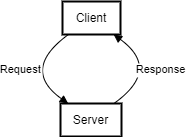

# Movies Library - 1.0.0

**Author Name**: Mohammed Alzoubi

## WRRC



## Overview

This project shows an example of requesting and responses from Third-party APIs inside a local java-script server.

## Getting Started

1. Clone this project to your local machine

    - HTTPS

    ```console
    git clone https://github.com/Alz3bi/Movies-Library.git
    ```

    - SSH

    ```console
    git clone https://github.com/Alz3bi/Movies-Library.git
    ```

2. install NPM and Node.js

3. Run the server

    ```console
    npm start
    ```

## Project Features

1. Fecth data from themoviedb API.
