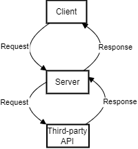

# Movies Library - 1.0.0

**Author Name**: Mohammed Alzoubi

## WRRC



## Overview

## Getting Started

1. Clone this project to your local machine

    - HTTPS

    ```console
    git clone https://github.com/Alz3bi/Movies-Library.git
    ```

    - SSH

    ```console
    git clone https://github.com/Alz3bi/Movies-Library.git
    ```

2. install NPM and Node.js, node Express

3. Run the server

    ```console
    npm start
    ```

## Project Features

1. Return Data From data.json to Home Page.
